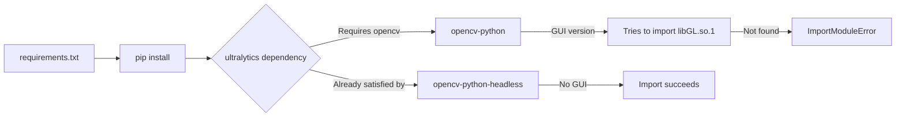

# Lambda OpenCV libGL.so.1 Fix

## Problem

Lambda functions failing with:
```
Runtime.ImportModuleError: Unable to import module 'app.main':
libGL.so.1: cannot open shared object file: No such file or directory
```

## Root Cause

**`ultralytics` (YOLO library) has a dependency conflict with OpenCV:**

1. We specify `opencv-python-headless` (no GUI dependencies) ✅
2. But `ultralytics` may pull in regular `opencv-python` (requires GUI libraries) ❌
3. Regular `opencv-python` tries to import `libGL.so.1` (OpenGL GUI library) ❌
4. Lambda containers don't have GUI libraries ❌
5. **Import fails before Lambda handler even runs** ❌

## Solution

**Install `opencv-python-headless` BEFORE other packages to satisfy OpenCV dependency:**

### Changes Made

#### 1. **Dockerfile Fix** (both Lambdas)

**Before:**
```dockerfile
RUN yum install -y mesa-libGL mesa-libGLU libglvnd-glx libglvnd-opengl
RUN pip install --no-cache-dir -r requirements.txt
```

**After:**
```dockerfile
# Remove GUI library installations (not needed for headless OpenCV)
RUN yum install -y gcc gcc-c++ make

# Install opencv-python-headless FIRST to prevent ultralytics from pulling regular opencv
RUN pip install --no-cache-dir opencv-python-headless==4.8.1.78 && \
    pip install --no-cache-dir -r requirements.txt && \
    python -c "import cv2; print(f'OpenCV version: {cv2.__version__}')"
```

**Key Changes:**
- ✅ Remove mesa-libGL, libglvnd-glx (GUI libraries not needed)
- ✅ Install opencv-python-headless **first** in separate command
- ✅ This prevents ultralytics from overriding with regular opencv-python
- ✅ Verify OpenCV loads successfully during build

#### 2. **requirements.txt Order** (both Lambdas)

**Before:**
```txt
opencv-python-headless==4.8.1.78
ultralytics==8.0.200
```

**After:**
```txt
# Install opencv-python-headless BEFORE ultralytics to avoid GUI dependencies
opencv-python-headless==4.8.1.78
# Install ultralytics without opencv dependencies (we already have headless version)
ultralytics==8.0.200
```

---

## Rebuild and Redeploy

### Quick Fix (Automated)

Run the automated rebuild script:

```bash
cd /Users/nosenfield/Desktop/GauntletAI/Week-4-Innergy/room-reader

# Rebuild both Lambdas with OpenCV fix
./infrastructure/scripts/rebuild-and-redeploy-v1.sh
```

This script will:
1. Login to ECR
2. Rebuild Docker images with fixed Dockerfiles
3. Push to ECR
4. Update Lambda functions
5. Test Lambda functions work
6. Show next steps

**Expected time:** 5-10 minutes (Docker build is slow)

### Manual Rebuild (if script fails)

```bash
cd backend

# Get AWS account ID
AWS_ACCOUNT_ID=$(aws sts get-caller-identity --query Account --output text)
AWS_REGION=us-east-1

# Login to ECR
aws ecr get-login-password --region $AWS_REGION | \
  docker login --username AWS --password-stdin ${AWS_ACCOUNT_ID}.dkr.ecr.${AWS_REGION}.amazonaws.com

# Build and push wall-detection-v1
docker build -t wall-detection-v1:latest -f lambda-wall-detection-v1/Dockerfile .
docker tag wall-detection-v1:latest ${AWS_ACCOUNT_ID}.dkr.ecr.${AWS_REGION}.amazonaws.com/wall-detection-v1:latest
docker push ${AWS_ACCOUNT_ID}.dkr.ecr.${AWS_REGION}.amazonaws.com/wall-detection-v1:latest

# Update Lambda function
aws lambda update-function-code \
  --function-name wall-detection-v1 \
  --image-uri ${AWS_ACCOUNT_ID}.dkr.ecr.${AWS_REGION}.amazonaws.com/wall-detection-v1:latest \
  --region $AWS_REGION

# Wait for update to complete
aws lambda wait function-updated --function-name wall-detection-v1 --region $AWS_REGION

# Repeat for geometric-conversion-v1
docker build -t geometric-conversion-v1:latest -f lambda-geometric-conversion-v1/Dockerfile .
docker tag geometric-conversion-v1:latest ${AWS_ACCOUNT_ID}.dkr.ecr.${AWS_REGION}.amazonaws.com/geometric-conversion-v1:latest
docker push ${AWS_ACCOUNT_ID}.dkr.ecr.${AWS_REGION}.amazonaws.com/geometric-conversion-v1:latest

aws lambda update-function-code \
  --function-name geometric-conversion-v1 \
  --image-uri ${AWS_ACCOUNT_ID}.dkr.ecr.${AWS_REGION}.amazonaws.com/geometric-conversion-v1:latest \
  --region $AWS_REGION

aws lambda wait function-updated --function-name geometric-conversion-v1 --region $AWS_REGION
```

---

## Verify Fix Works

### Test 1: Lambda Health Check (Direct Invoke)

```bash
# Test wall-detection-v1
aws lambda invoke \
  --function-name wall-detection-v1 \
  --payload '{"httpMethod":"GET","path":"/","headers":{},"body":null}' \
  --region us-east-1 \
  response.json

cat response.json | jq .
```

**Expected Response:**
```json
{
  "statusCode": 200,
  "headers": {
    "Access-Control-Allow-Origin": "*",
    "Content-Type": "application/json"
  },
  "body": "{\"service\":\"wall-detection-v1\",\"status\":\"healthy\",\"model_loaded\":true}"
}
```

**Success Indicators:**
- ✅ `statusCode: 200`
- ✅ `model_loaded: true`
- ✅ No `ImportModuleError` in response

**If it fails:**
- ❌ Check CloudWatch logs: `aws logs tail /aws/lambda/wall-detection-v1 --follow`
- ❌ Look for import errors in logs
- ❌ Verify Docker image was rebuilt (not using cached version)

### Test 2: Lambda via API Gateway

```bash
API_URL="https://3jkxonfmu1.execute-api.us-east-1.amazonaws.com/prod"

curl -X GET "${API_URL}/api/detect-walls" -i
```

**Expected:** HTTP 405 (Method Not Allowed) because we sent GET instead of POST
- This proves Lambda is running (not import error)

```bash
curl -X POST \
  -H "Content-Type: application/json" \
  -d '{"image":"","confidence_threshold":0.1}' \
  "${API_URL}/api/detect-walls"
```

**Expected:** Error about invalid base64 image (proves Lambda is processing requests)

### Test 3: Check CloudWatch Logs

```bash
# Watch Lambda logs in real-time
aws logs tail /aws/lambda/wall-detection-v1 --follow --region us-east-1
```

**Success Indicators:**
```
Loading wall detection model from /app/models/best_wall_model.pt
Model loaded successfully
Wall detector ready
```

**Failure Indicators (old problem):**
```
[ERROR] Runtime.ImportModuleError: Unable to import module 'app.main': libGL.so.1
```

---

## Why This Fix Works

### Understanding the Problem

1. **Lambda uses container images** (Docker)
2. **Container startup sequence:**
   ```
   Container starts → Python imports modules → Lambda handler ready
   ```
3. **Import happens BEFORE Lambda handler runs**
4. **If import fails, Lambda never becomes ready**

### The OpenCV Conflict



### Solution Explanation

**By installing `opencv-python-headless` first:**
- Python package manager sees OpenCV requirement is satisfied
- Doesn't install regular `opencv-python`
- No GUI dependencies pulled in
- `libGL.so.1` not needed
- Import succeeds ✅

---

## Prevention for Future

### When Adding New Dependencies

1. **Always use `opencv-python-headless` in Lambda:**
   ```txt
   opencv-python-headless==4.8.1.78  # ✅ Correct
   opencv-python==4.8.1.78            # ❌ Wrong (requires GUI)
   ```

2. **Install opencv-python-headless FIRST in Dockerfile:**
   ```dockerfile
   RUN pip install opencv-python-headless==4.8.1.78 && \
       pip install -r requirements.txt
   ```

3. **Don't install GUI libraries in Lambda:**
   ```dockerfile
   # ❌ DON'T DO THIS
   RUN yum install -y mesa-libGL libglvnd-glx

   # ✅ DO THIS (minimal dependencies)
   RUN yum install -y gcc gcc-c++ make
   ```

4. **Test imports during Docker build:**
   ```dockerfile
   RUN python -c "import cv2; print(f'OpenCV: {cv2.__version__}')"
   RUN python -c "from ultralytics import YOLO; print('YOLO OK')"
   ```

### Local Testing Before Deploy

```bash
# Build Docker image locally
docker build -t test-lambda -f lambda-wall-detection-v1/Dockerfile .

# Test imports work
docker run --rm test-lambda python -c "import cv2; from ultralytics import YOLO; print('✅ All imports successful')"
```

If this succeeds locally, it will work in Lambda.

---

## Troubleshooting

### Issue: Still Getting libGL.so.1 Error

**Possible Causes:**
1. **Docker cache:** Old image layer cached
2. **Lambda not updated:** Still using old image
3. **Wrong OpenCV version installed:** Regular opencv-python instead of headless

**Solutions:**

```bash
# Force rebuild without cache
docker build --no-cache -t wall-detection-v1:latest -f lambda-wall-detection-v1/Dockerfile .

# Verify which OpenCV is installed in container
docker run --rm wall-detection-v1:latest pip list | grep opencv

# Should show:
# opencv-python-headless  4.8.1.78

# Should NOT show:
# opencv-python           4.8.1.78  ❌
```

### Issue: Lambda Times Out

**Cause:** Model file too large or not found

**Check:**
```bash
# Check model file exists in container
docker run --rm wall-detection-v1:latest ls -lh /app/models/

# Expected:
# -rw-r--r-- 1 root root 180M ... best_wall_model.pt
```

### Issue: Lambda Memory Error

**Cause:** Model + dependencies exceed memory limit

**Solution:**
```bash
# Increase Lambda memory
aws lambda update-function-configuration \
  --function-name wall-detection-v1 \
  --memory-size 3008 \
  --region us-east-1
```

---

## Success Checklist

After running rebuild script, verify:

- [ ] Docker images built successfully (no errors)
- [ ] Images pushed to ECR
- [ ] Lambda functions updated
- [ ] Lambda health check returns 200
- [ ] CloudWatch logs show "Model loaded successfully"
- [ ] No "ImportModuleError" in logs
- [ ] API Gateway endpoints respond (even if CORS error)
- [ ] Ready to fix CORS issues

---

## Next Steps

Once Lambda import issue is fixed:

1. **Fix CORS:** `./infrastructure/scripts/fix-cors.sh`
2. **Test from frontend:** Upload image and verify detection works
3. **Monitor CloudWatch:** Watch for errors during real usage
4. **Deploy v2 model:** Follow Phase 2 of task list

---

## References

- [OpenCV Headless in Lambda](https://github.com/aws/aws-lambda-base-images/issues/42)
- [Ultralytics YOLO Lambda Deployment](https://docs.ultralytics.com/guides/aws-lambda/)
- [Lambda Container Images](https://docs.aws.amazon.com/lambda/latest/dg/images-create.html)
