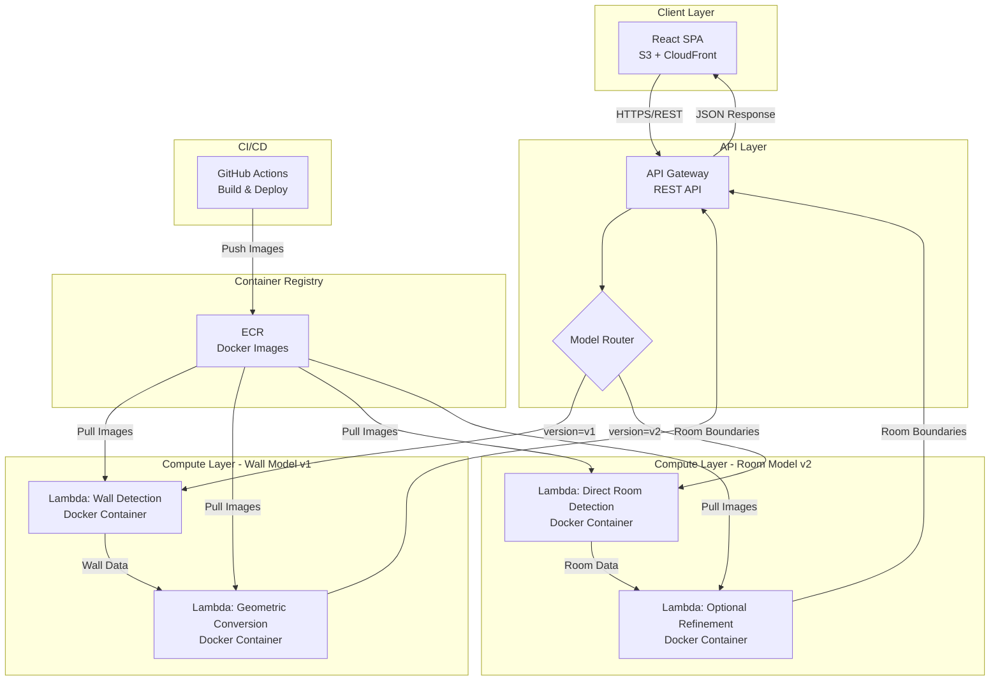
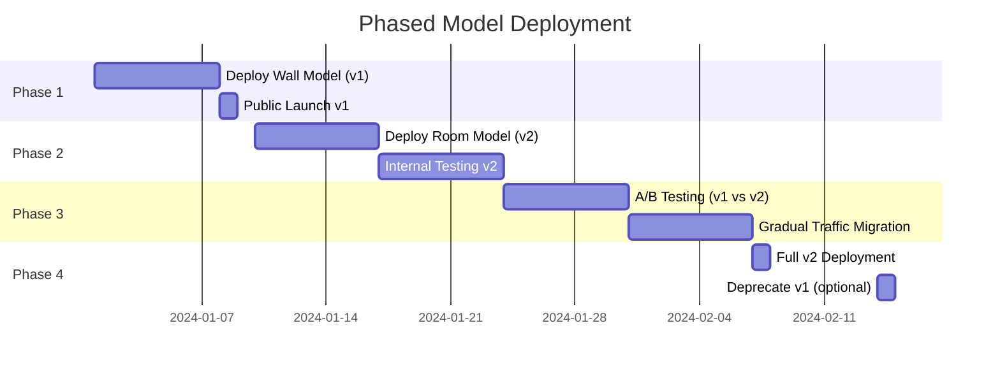
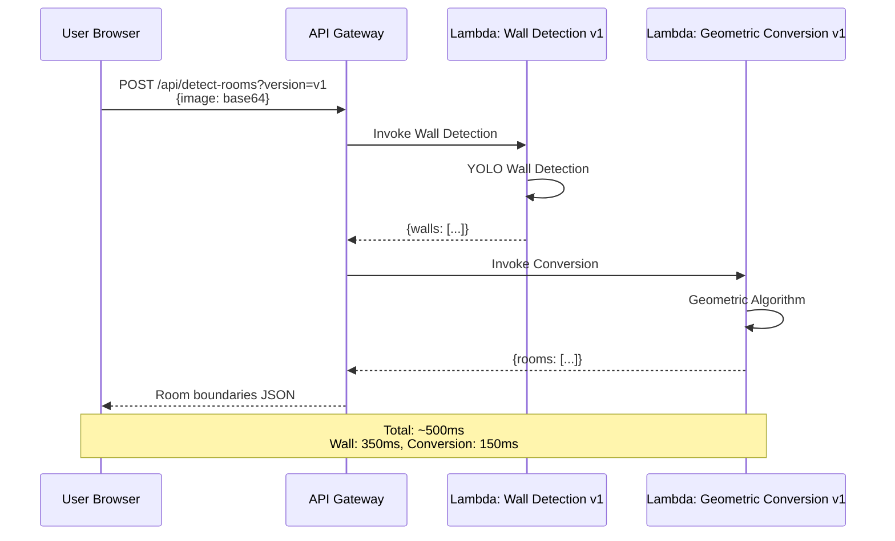
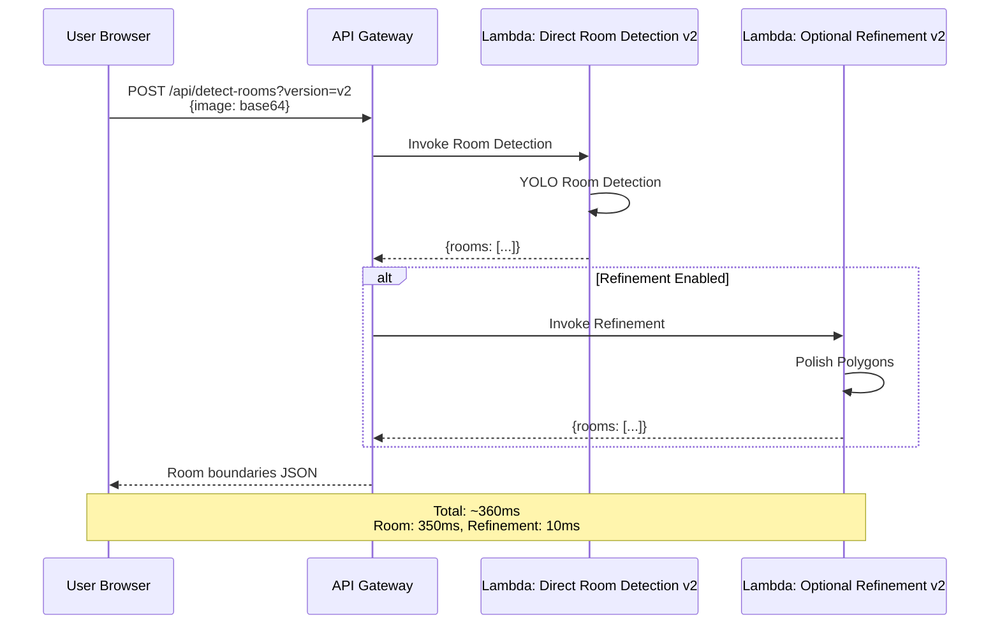
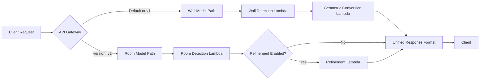

# Revised Architecture Documentation - Independent Model Deployment

## Overview

**Project:** Room Boundary Detection System  
**Purpose:** Automated detection of room boundaries from architectural blueprints  
**Architecture Pattern:** Independent Lambda Functions per Model  
**Deployment Strategy:** Wall Model First (v1), Room Model Later (v2)  

---

## Core Design Principles

### Independence First
```yaml
Principle: Each detection model is a completely independent, deployable system
Benefits:
  - Deploy wall model to production immediately
  - Room model issues don't block wall model deployment
  - Independent scaling and optimization
  - Easy A/B testing and gradual migration
  - Simple rollback capabilities
```

### Model-Agnostic API
```yaml
Principle: Unified API interface regardless of underlying model
Benefits:
  - Client code unchanged when switching models
  - Transparent model upgrades
  - Easy A/B testing at API Gateway level
  - Future model additions require no client changes
```

### Shared Components Minimized
```yaml
Principle: Share only data contracts, not implementation
Shared:
  - Pydantic models (request/response schemas)
  - Utility functions (image processing helpers)
  - Type definitions
NOT Shared:
  - Detection logic
  - Model inference code
  - Business logic
```

---

## System Architecture

### High-Level Architecture - Independent Lambdas



### Deployment Timeline



---

## Request Flow

### Version 1: Wall Model (Deploy First)



### Version 2: Room Model (Deploy Later)



### Unified API Request Flow



---

## API Specification

### Unified Endpoint

```
POST /api/detect-rooms
Content-Type: application/json
```

**Request:**
```typescript
interface DetectionRequest {
  // Required
  image: string;                    // Base64 encoded image
  
  // Optional - Model Selection
  version?: "v1" | "v2";           // Default: "v1"
  model_type?: "wall" | "room";    // Alias for version
  
  // Optional - Model Parameters
  confidence_threshold?: number;    // Default: 0.10
  min_room_area?: number;          // Default: 2000
  
  // Optional - Output Control
  return_visualization?: boolean;   // Default: true
  enable_refinement?: boolean;      // Default: false (v2 only)
  
  // Optional - Metadata
  image_format?: string;           // Default: "png"
}
```

**Response (Unified Format for Both Models):**
```typescript
interface DetectionResponse {
  success: boolean;
  
  // Core Results
  rooms: Array<{
    id: string;
    polygon_vertices: Array<[number, number]>;
    bounding_box: {
      x_min: number;
      y_min: number;
      x_max: number;
      y_max: number;
    };
    area_pixels: number;
    centroid: [number, number];
    confidence: number;
    shape_type: "rectangle" | "l_shape" | "complex";
    num_vertices: number;
  }>;
  
  // Metadata
  total_rooms: number;
  processing_time_ms: number;
  model_version: "v1" | "v2";
  
  // Optional Outputs
  visualization?: string;           // Base64 encoded image
  
  // Diagnostics (optional)
  metadata: {
    image_dimensions: [number, number];
    model_type: "wall" | "room";
    refinement_applied: boolean;
    intermediate_detections?: number; // walls detected (v1 only)
  };
}
```

**Error Response (Unified):**
```typescript
interface ErrorResponse {
  success: false;
  error: {
    code: string;
    message: string;
    details?: any;
  };
  model_version: "v1" | "v2";
}
```

---

## Component Architecture

### Lambda Function: Wall Detection v1

```mermaid
graph TB
    subgraph "Wall Detection Lambda v1"
        A[FastAPI App] --> B[/api/detect-walls]
        B --> C[Request Validation]
        C --> D[Image Decode]
        D --> E[YOLO Wall Model]
        E --> F[Post-Processing]
        F --> G[Response Format]
        
        subgraph "YOLO Pipeline"
            E --> E1[Load Model<br/>best_wall_model.pt]
            E1 --> E2[Inference]
            E2 --> E3[NMS]
            E3 --> E4[Filter Confidence]
        end
    end
```

**Deployment:**
```yaml
Function Name: wall-detection-v1
Runtime: Container Image
Memory: 3GB
Timeout: 30s
Environment:
  MODEL_PATH: /app/models/best_wall_model.pt
  CONFIDENCE_THRESHOLD: 0.10
```

---

### Lambda Function: Geometric Conversion v1

```mermaid
graph TB
    subgraph "Geometric Conversion Lambda v1"
        A[FastAPI App] --> B[/api/convert-to-rooms]
        B --> C[Request Validation]
        C --> D[Grid Creation]
        D --> E[Wall Drawing]
        E --> F[Morphological Ops]
        F --> G[Connected Components]
        G --> H[Polygon Extraction]
        H --> I[Visualization]
        I --> J[Response Format]
        
        subgraph "Geometric Algorithm"
            D --> D1[Binary Grid]
            E --> E1[Draw Walls]
            E1 --> E2[Invert Grid]
            F --> F1[Closing]
            F1 --> F2[Opening]
            G --> G1[CCL Algorithm]
            G1 --> G2[Filter Area]
            H --> H1[Find Contours]
            H1 --> H2[Simplify Polygons]
        end
    end
```

**Deployment:**
```yaml
Function Name: geometric-conversion-v1
Runtime: Container Image
Memory: 2GB
Timeout: 30s
Environment:
  MIN_ROOM_AREA: 2000
  KERNEL_SIZE: 3
  EPSILON_FACTOR: 0.01
  REFINEMENT_ENABLED: true
```

---

### Lambda Function: Direct Room Detection v2

```mermaid
graph TB
    subgraph "Direct Room Detection Lambda v2"
        A[FastAPI App] --> B[/api/detect-rooms-direct]
        B --> C[Request Validation]
        C --> D[Image Decode]
        D --> E[YOLO Room Model]
        E --> F[Segmentation Extract]
        F --> G[Polygon Format]
        G --> H[Confidence Filter]
        H --> I[Response Format]
        
        subgraph "YOLO Pipeline"
            E --> E1[Load Model<br/>best_room_model.pt]
            E1 --> E2[Inference]
            E2 --> E3[Get Masks]
            E3 --> E4[Extract Polygons]
        end
    end
```

**Deployment:**
```yaml
Function Name: room-detection-v2
Runtime: Container Image
Memory: 3GB
Timeout: 30s
Environment:
  MODEL_PATH: /app/models/best_room_model.pt
  CONFIDENCE_THRESHOLD: 0.10
  USE_SEGMENTATION: true
  FALLBACK_TO_BBOX: true
```

---

### Lambda Function: Optional Refinement v2

```mermaid
graph TB
    subgraph "Refinement Lambda v2"
        A[FastAPI App] --> B[/api/refine-rooms]
        B --> C[Request Validation]
        C --> D[Polygon Analysis]
        D --> E{Needs Refinement?}
        E -->|Yes| F[Morphological Ops]
        E -->|No| H[Pass Through]
        F --> G[Re-extract Polygons]
        G --> H
        H --> I[Response Format]
    end
```

**Deployment:**
```yaml
Function Name: room-refinement-v2
Runtime: Container Image
Memory: 2GB
Timeout: 15s
Environment:
  KERNEL_SIZE: 3
  EPSILON_FACTOR: 0.01
```

---

## API Gateway Configuration

### Route Mapping

```yaml
API Gateway: room-detection-api

Resources:
  /api/detect-rooms:
    POST:
      integration_type: AWS_PROXY
      
      # Default to v1 (wall model)
      default_integration: wall-detection-v1
      
      # Route based on query parameter
      request_parameters:
        - version (optional)
      
      integrations:
        - condition: $input.params('version') == 'v1'
          target: wall-detection-v1
          
        - condition: $input.params('version') == 'v2'
          target: room-detection-v2
          
        - condition: no version specified
          target: wall-detection-v1  # Default
```

### Alternative: Separate Endpoints (Simpler)

```yaml
API Gateway: room-detection-api

Resources:
  /api/v1/detect-rooms:
    POST:
      integration: wall-detection-v1 Lambda
      
  /api/v2/detect-rooms:
    POST:
      integration: room-detection-v2 Lambda
      
  /api/detect-rooms:  # Unified endpoint
    POST:
      integration: Lambda Proxy Router
      # Routes to v1 or v2 based on request parameter
```

**Recommended:** Use separate versioned endpoints (`/api/v1/detect-rooms`, `/api/v2/detect-rooms`) for simplicity and explicit control.

---

## Directory Structure

```
room-boundary-detection/
├── backend/
│   ├── shared/                          # Shared utilities only
│   │   ├── models.py                   # Pydantic schemas
│   │   ├── image_utils.py              # Image processing helpers
│   │   ├── validation.py               # Common validators
│   │   └── __init__.py
│   │
│   ├── lambda-wall-detection-v1/       # Independent deployment
│   │   ├── Dockerfile
│   │   ├── requirements.txt
│   │   ├── app/
│   │   │   ├── __init__.py
│   │   │   ├── main.py                # FastAPI app
│   │   │   ├── detection.py           # YOLO wall detection
│   │   │   └── config.py
│   │   ├── models/
│   │   │   └── best_wall_model.pt     # YOLO weights
│   │   └── tests/
│   │       └── test_wall_detection.py
│   │
│   ├── lambda-geometric-conversion-v1/ # Independent deployment
│   │   ├── Dockerfile
│   │   ├── requirements.txt
│   │   ├── app/
│   │   │   ├── __init__.py
│   │   │   ├── main.py                # FastAPI app
│   │   │   ├── geometric.py           # Conversion algorithm
│   │   │   └── config.py
│   │   └── tests/
│   │       └── test_conversion.py
│   │
│   ├── lambda-room-detection-v2/       # Independent deployment
│   │   ├── Dockerfile
│   │   ├── requirements.txt
│   │   ├── app/
│   │   │   ├── __init__.py
│   │   │   ├── main.py                # FastAPI app
│   │   │   ├── detection.py           # YOLO room detection
│   │   │   └── config.py
│   │   ├── models/
│   │   │   └── best_room_model.pt     # YOLO weights
│   │   └── tests/
│   │       └── test_room_detection.py
│   │
│   └── lambda-room-refinement-v2/      # Independent deployment
│       ├── Dockerfile
│       ├── requirements.txt
│       ├── app/
│       │   ├── __init__.py
│       │   ├── main.py                # FastAPI app
│       │   ├── refinement.py          # Polygon refinement
│       │   └── config.py
│       └── tests/
│           └── test_refinement.py
│
├── frontend/
│   ├── src/
│   │   ├── components/
│   │   │   ├── Upload.tsx
│   │   │   ├── Results.tsx
│   │   │   └── ModelSelector.tsx      # NEW: Choose v1 or v2
│   │   ├── services/
│   │   │   └── api.ts                 # API client with version support
│   │   ├── types/
│   │   │   └── detection.ts           # TypeScript types
│   │   └── App.tsx
│   ├── package.json
│   └── vite.config.ts
│
├── infrastructure/
│   ├── terraform/
│   │   ├── main.tf
│   │   ├── lambda-v1.tf               # Wall model Lambdas
│   │   ├── lambda-v2.tf               # Room model Lambdas
│   │   ├── api-gateway.tf             # API Gateway with routing
│   │   └── variables.tf
│   └── scripts/
│       ├── deploy-v1.sh               # Deploy wall model only
│       ├── deploy-v2.sh               # Deploy room model only
│       └── deploy-all.sh              # Deploy both
│
├── .github/
│   └── workflows/
│       ├── deploy-v1.yml              # CI/CD for wall model
│       ├── deploy-v2.yml              # CI/CD for room model
│       └── deploy-unified.yml         # Deploy both together
│
└── docs/
    ├── REVISED_ARCHITECTURE.md        # This file
    ├── REVISED_TASK_LIST.md
    └── MODEL_INTEGRATION_GUIDE.md
```

---

## Shared Components

### Pydantic Models (Shared)

**File:** `backend/shared/models.py`

```python
"""
Shared data models for all Lambda functions.
These define the contract but not the implementation.
"""
from typing import List, Tuple, Optional, Literal
from pydantic import BaseModel, Field


class BoundingBox(BaseModel):
    """Standard bounding box format"""
    x_min: int
    y_min: int
    x_max: int
    y_max: int


class Room(BaseModel):
    """Unified room representation for all models"""
    id: str
    polygon_vertices: List[Tuple[int, int]]
    bounding_box: BoundingBox
    area_pixels: int
    centroid: Tuple[int, int]
    confidence: float = Field(..., ge=0.0, le=1.0)
    shape_type: Literal["rectangle", "l_shape", "complex"]
    num_vertices: int


class DetectionRequest(BaseModel):
    """Unified request format"""
    image: str                              # Base64 encoded
    version: Optional[Literal["v1", "v2"]] = "v1"
    confidence_threshold: Optional[float] = 0.10
    min_room_area: Optional[int] = 2000
    return_visualization: Optional[bool] = True
    enable_refinement: Optional[bool] = False
    image_format: Optional[str] = "png"


class DetectionResponse(BaseModel):
    """Unified response format"""
    success: bool
    rooms: List[Room]
    total_rooms: int
    processing_time_ms: float
    model_version: Literal["v1", "v2"]
    visualization: Optional[str] = None
    metadata: dict


class ErrorResponse(BaseModel):
    """Standard error format"""
    success: bool = False
    error: dict
    model_version: Optional[Literal["v1", "v2"]] = None
```

### Image Utilities (Shared)

**File:** `backend/shared/image_utils.py`

```python
"""
Shared image processing utilities.
No business logic, only helper functions.
"""
import base64
import numpy as np
import cv2
from PIL import Image
from io import BytesIO


def decode_base64_image(base64_string: str) -> np.ndarray:
    """Decode base64 string to OpenCV image"""
    image_data = base64.b64decode(base64_string)
    image = Image.open(BytesIO(image_data))
    return cv2.cvtColor(np.array(image), cv2.COLOR_RGB2BGR)


def encode_image_to_base64(image: np.ndarray, format: str = "png") -> str:
    """Encode OpenCV image to base64 string"""
    _, buffer = cv2.imencode(f'.{format}', image)
    return base64.b64encode(buffer).decode('utf-8')


def validate_image_dimensions(image: np.ndarray, max_size: int = 4096) -> bool:
    """Check if image dimensions are valid"""
    h, w = image.shape[:2]
    return w <= max_size and h <= max_size


def resize_if_needed(
    image: np.ndarray, 
    max_size: int = 2048
) -> Tuple[np.ndarray, float]:
    """Resize image if too large, return image and scale factor"""
    h, w = image.shape[:2]
    
    if w <= max_size and h <= max_size:
        return image, 1.0
    
    scale = max_size / max(w, h)
    new_w = int(w * scale)
    new_h = int(h * scale)
    
    resized = cv2.resize(image, (new_w, new_h), interpolation=cv2.INTER_AREA)
    return resized, scale
```

---

## Performance Characteristics

### Version 1: Wall Model

```yaml
Cold Start: 3-5 seconds
Warm Execution: 500ms
  - Wall Detection: 350ms
  - Geometric Conversion: 150ms

Memory Usage:
  - Wall Detection Lambda: 2.5GB
  - Conversion Lambda: 1.8GB

Success Rate: 45-60%
  - Depends on wall completeness
  - Fails with incomplete walls

Cost per Request: $0.0004
```

### Version 2: Room Model

```yaml
Cold Start: 3-5 seconds
Warm Execution: 360ms
  - Room Detection: 350ms
  - Optional Refinement: 10ms

Memory Usage:
  - Room Detection Lambda: 2.5GB
  - Refinement Lambda: 1.5GB

Success Rate: 85-95%
  - Direct room detection
  - Handles partial walls

Cost per Request: $0.0004
```

### Comparison

| Metric | v1 (Wall) | v2 (Room) | Winner |
|--------|-----------|-----------|--------|
| Speed | 500ms | 360ms | v2 (28% faster) |
| Accuracy | 45-60% | 85-95% | v2 (+50% detection) |
| Memory | 4.3GB total | 4GB total | v2 (slightly) |
| Complexity | High | Low | v2 (simpler) |
| Robustness | Low | High | v2 (handles edge cases) |

---

## Deployment Strategy

### Phase 1: Wall Model Launch (Week 1)

```yaml
Goal: Get to production immediately with wall model

Tasks:
  - Deploy wall-detection-v1 Lambda
  - Deploy geometric-conversion-v1 Lambda
  - Configure API Gateway /api/v1/detect-rooms
  - Deploy React frontend with v1 support
  - Public launch

Status: READY TO DEPLOY

Acceptance:
  - Public users can detect rooms via wall model
  - System handles 100+ requests/day
  - Monitoring and alerts configured
```

### Phase 2: Room Model Integration (Week 2-3)

```yaml
Goal: Deploy room model alongside wall model

Tasks:
  - Build room-detection-v2 Docker container
  - Deploy room-detection-v2 Lambda
  - Deploy room-refinement-v2 Lambda (optional)
  - Configure API Gateway /api/v2/detect-rooms
  - Add frontend toggle for v1/v2 selection
  - Internal testing

Status: PENDING (room model needs Docker deployment)

Acceptance:
  - v2 endpoints respond correctly
  - Both v1 and v2 work independently
  - Frontend can switch between versions
```

### Phase 3: A/B Testing (Week 4)

```yaml
Goal: Compare models with real usage data

Tasks:
  - Deploy both versions to production
  - Configure traffic split (50/50 or 90/10)
  - Collect metrics:
    - Detection rate
    - User satisfaction
    - Processing time
    - Error rates
  - Analyze results

Acceptance:
  - 100+ requests processed per model
  - Clear performance comparison data
  - Decision made on default model
```

### Phase 4: Migration (Week 5)

```yaml
Goal: Make room model the default

Tasks:
  - Update API Gateway default route to v2
  - Maintain v1 for fallback
  - Monitor for issues
  - Gradual traffic migration (10% -> 50% -> 100%)

Acceptance:
  - 95% of traffic on v2
  - No increase in error rate
  - User satisfaction maintained/improved
```

---

## Traffic Routing Configuration

### API Gateway Routing (Recommended)

**Separate Endpoints:**
```yaml
# Explicit versioning - SIMPLE and CLEAR

/api/v1/detect-rooms:
  target: wall-detection-v1
  status: Production
  
/api/v2/detect-rooms:
  target: room-detection-v2
  status: Beta → Production
  
/api/detect-rooms:
  # Default route (changes over time)
  target: v1 (initially) → v2 (after migration)
  query_override: ?version=v1 or ?version=v2
```

**Migration Path:**
```
Week 1:   /api/detect-rooms → v1 (100%)
Week 4:   /api/detect-rooms → v1 (90%), v2 (10%)
Week 5:   /api/detect-rooms → v1 (50%), v2 (50%)
Week 6:   /api/detect-rooms → v1 (10%), v2 (90%)
Week 7+:  /api/detect-rooms → v2 (100%)
```

### Traffic Split via API Gateway

```json
{
  "routes": [
    {
      "path": "/api/detect-rooms",
      "methods": ["POST"],
      "backends": [
        {
          "target": "wall-detection-v1",
          "weight": 10
        },
        {
          "target": "room-detection-v2",
          "weight": 90
        }
      ]
    }
  ]
}
```

---

## Monitoring & Observability

### CloudWatch Metrics (Per Version)

```yaml
Wall Model v1:
  - /aws/lambda/wall-detection-v1
    - Invocations
    - Duration
    - Errors
    - Throttles
    - Cold starts
  - /aws/lambda/geometric-conversion-v1
    - Invocations
    - Duration
    - Errors

Room Model v2:
  - /aws/lambda/room-detection-v2
    - Invocations
    - Duration
    - Errors
    - Throttles
    - Cold starts
  - /aws/lambda/room-refinement-v2
    - Invocations
    - Duration
    - Errors

Custom Metrics:
  - DetectionSuccessRate (v1 vs v2)
  - RoomsDetectedCount (v1 vs v2)
  - AverageConfidenceScore (v1 vs v2)
  - UserSatisfactionScore (v1 vs v2)
```

### CloudWatch Dashboard

```yaml
Dashboard Name: room-detection-comparison

Widgets:
  - Request Volume (v1 vs v2)
  - Success Rate (v1 vs v2)
  - Average Latency (v1 vs v2)
  - Error Rate (v1 vs v2)
  - Cost per Request (v1 vs v2)
  - Detection Rate (rooms found / expected)
  - User Satisfaction (if feedback collected)
```

### Alarms

```yaml
Critical Alarms:
  - v1-error-rate-high:
      threshold: >5% errors
      action: SNS notification
      
  - v2-error-rate-high:
      threshold: >5% errors
      action: SNS notification
      
  - detection-failure-v1:
      threshold: 0 rooms detected >10 times/hour
      action: Auto-failover to v2
      
  - api-gateway-5xx:
      threshold: >10 errors in 5 minutes
      action: SNS + PagerDuty

Warning Alarms:
  - v1-latency-high:
      threshold: >1000ms average
      
  - v2-latency-high:
      threshold: >800ms average
```

---

## Cost Estimation

### Monthly Cost (1000 requests, dual deployment)

```yaml
Lambda Execution:
  v1 Path:
    Wall Detection: 1000 × 2s × $0.0000166667 = $0.033
    Conversion: 1000 × 0.5s × $0.0000133333 = $0.007
    Subtotal v1: $0.04
    
  v2 Path:
    Room Detection: 1000 × 1.5s × $0.0000166667 = $0.025
    Refinement: 1000 × 0.2s × $0.0000133333 = $0.003
    Subtotal v2: $0.028
    
  Total Lambda (both active): $0.068
  
API Gateway:
  Requests: 2000 × $0.0000035 = $0.007
  
CloudFront:
  Requests: 1000 × $0.0000010 = $0.001
  Data Transfer: 1 GB × $0.085 = $0.085
  
S3:
  Storage: 0.1 GB × $0.023 = $0.002
  
ECR:
  Storage: 4 images × 0.5 GB × $0.10 = $0.20
  
Total Monthly Cost (dual deployment): ~$0.36

After v1 deprecation (v2 only): ~$0.31
```

---

## Security Considerations

### Independent Security Contexts

```yaml
Wall Model v1:
  Execution Role: wall-detection-v1-role
  Permissions:
    - CloudWatch Logs (write)
    - No S3 access
    - No cross-Lambda invocation
    
Room Model v2:
  Execution Role: room-detection-v2-role
  Permissions:
    - CloudWatch Logs (write)
    - No S3 access
    - No cross-Lambda invocation

Benefit: Security issue in v1 doesn't affect v2
```

### API Gateway Security

```yaml
Authentication:
  Phase 1 (MVP): None
  Phase 2: API Key
  Phase 3: Cognito JWT
  
Rate Limiting:
  - 100 requests per minute per IP
  - 1000 requests per day per API key
  
CORS:
  - Allowed Origins: CloudFront domain
  - Allowed Methods: POST, OPTIONS
  - Credentials: false
```

---

## Rollback Strategy

### Version Rollback

```yaml
Scenario: v2 has critical bug

Steps:
  1. Update API Gateway default route
     /api/detect-rooms → v1 (immediate)
     
  2. Disable v2 endpoints
     /api/v2/detect-rooms → 503 Service Unavailable
     
  3. Frontend update
     Hide v2 selector, default to v1
     
  4. Investigate and fix v2
  
  5. Gradual re-enable
     /api/detect-rooms → v1 (90%), v2 (10%)
     Monitor and increase v2 traffic

Rollback Time: <5 minutes (just API Gateway config change)
```

### Lambda Version Rollback

```yaml
Each Lambda has versioned deployments:
  - $LATEST: Current deployment
  - v1: Previous stable version
  - v2: Version before that

Rollback:
  aws lambda update-alias \
    --function-name room-detection-v2 \
    --name production \
    --function-version 1  # Roll back to v1

Rollback Time: <1 minute
```

---

## Testing Strategy

### Independent Testing

```yaml
Wall Model v1 Testing:
  - Unit tests for detection logic
  - Integration tests for Lambda
  - End-to-end tests via API
  - Load testing (100 concurrent requests)
  
Room Model v2 Testing:
  - Unit tests for detection logic
  - Integration tests for Lambda
  - End-to-end tests via API
  - Load testing (100 concurrent requests)
  
Comparison Testing:
  - Send same image to v1 and v2
  - Compare results
  - Measure accuracy differences
  - Record performance metrics
```

### Test Suites

**File:** `backend/lambda-wall-detection-v1/tests/test_detection.py`
```python
import pytest
from app.detection import WallDetector

def test_wall_detection():
    detector = WallDetector()
    walls = detector.detect(sample_image)
    assert len(walls) > 0
    assert all(w.confidence > 0.5 for w in walls)

def test_empty_image():
    detector = WallDetector()
    walls = detector.detect(blank_image)
    assert len(walls) == 0
```

**File:** `backend/lambda-room-detection-v2/tests/test_detection.py`
```python
import pytest
from app.detection import RoomDetector

def test_room_detection():
    detector = RoomDetector()
    rooms = detector.detect(sample_image)
    assert len(rooms) > 0
    assert all(r.confidence > 0.7 for r in rooms)

def test_segmentation_output():
    detector = RoomDetector()
    rooms = detector.detect(sample_image)
    for room in rooms:
        assert len(room.polygon_vertices) >= 4
```

---

## Migration Guide

### For Developers

**Deploy v1 (Wall Model) - Immediate:**
```bash
cd backend/lambda-wall-detection-v1
docker build -t wall-detection-v1:latest .
docker push {ecr}/wall-detection-v1:latest

cd backend/lambda-geometric-conversion-v1
docker build -t geometric-conversion-v1:latest .
docker push {ecr}/geometric-conversion-v1:latest

# Update Lambda functions
aws lambda update-function-code \
  --function-name wall-detection-v1 \
  --image-uri {ecr}/wall-detection-v1:latest

aws lambda update-function-code \
  --function-name geometric-conversion-v1 \
  --image-uri {ecr}/geometric-conversion-v1:latest
```

**Deploy v2 (Room Model) - When Ready:**
```bash
cd backend/lambda-room-detection-v2
docker build -t room-detection-v2:latest .
docker push {ecr}/room-detection-v2:latest

cd backend/lambda-room-refinement-v2
docker build -t room-refinement-v2:latest .
docker push {ecr}/room-refinement-v2:latest

# Update Lambda functions
aws lambda update-function-code \
  --function-name room-detection-v2 \
  --image-uri {ecr}/room-detection-v2:latest

aws lambda update-function-code \
  --function-name room-refinement-v2 \
  --image-uri {ecr}/room-refinement-v2:latest
```

### For Frontend Developers

**API Client with Version Support:**

```typescript
// src/services/api.ts
export type ModelVersion = 'v1' | 'v2';

export async function detectRooms(
  imageBase64: string,
  version: ModelVersion = 'v1',
  options?: DetectionOptions
): Promise<DetectionResponse> {
  const endpoint = version === 'v1' 
    ? '/api/v1/detect-rooms'
    : '/api/v2/detect-rooms';
  
  const response = await fetch(API_BASE_URL + endpoint, {
    method: 'POST',
    headers: { 'Content-Type': 'application/json' },
    body: JSON.stringify({
      image: imageBase64,
      ...options
    })
  });
  
  return response.json();
}
```

**Model Selector Component:**

```typescript
// src/components/ModelSelector.tsx
export function ModelSelector() {
  const [version, setVersion] = useState<ModelVersion>('v1');
  
  return (
    <div>
      <label>Detection Model:</label>
      <select value={version} onChange={e => setVersion(e.target.value)}>
        <option value="v1">Wall Model (Stable)</option>
        <option value="v2">Room Model (Beta)</option>
      </select>
    </div>
  );
}
```

---

## Future Enhancements

### Phase 5: Model Ensemble

```yaml
Strategy: Use both models and combine results

Implementation:
  1. Run v1 and v2 in parallel
  2. Merge results using confidence scores
  3. Validate with geometric constraints
  4. Return best combined result

Benefits:
  - Highest accuracy
  - Redundancy
  - Best of both worlds

Cost: 2x processing (run both models)
```

### Phase 6: Model Registry

```yaml
Feature: Dynamic model management

Components:
  - S3 bucket for model versions
  - DynamoDB for model metadata
  - Lambda layers for model loading
  - API for model selection

Benefits:
  - Hot-swap models without redeployment
  - A/B test multiple models
  - Gradual rollout of new models
  - Model performance tracking
```

### Phase 7: Custom Models per Client

```yaml
Feature: Client-specific fine-tuned models

Architecture:
  - Base model (v1 or v2)
  - Client-specific fine-tuning
  - Model selection via client ID
  - Separate Lambda per client model

Use Case:
  - Enterprise clients with specific blueprint styles
  - Industry-specific requirements
  - Higher accuracy for paying customers
```

---

## Success Criteria

### Phase 1 (Wall Model v1) - Week 1

```yaml
Technical:
  ✅ Wall detection Lambda deployed
  ✅ Geometric conversion Lambda deployed
  ✅ API Gateway configured
  ✅ Frontend deployed
  ✅ End-to-end flow works
  ✅ <5s total processing time
  ✅ <$1/month cost (MVP scale)

Business:
  ✅ Public users can process blueprints
  ✅ 45-60% room detection rate achieved
  ✅ No critical bugs for 7 days
  ✅ User feedback collected
```

### Phase 2 (Room Model v2) - Week 3

```yaml
Technical:
  ✅ Room detection Lambda deployed
  ✅ Refinement Lambda deployed (optional)
  ✅ API Gateway v2 endpoint configured
  ✅ Frontend supports v1/v2 toggle
  ✅ Both models work independently
  ✅ <4s total processing time (v2)

Business:
  ✅ Internal testing shows >85% detection rate
  ✅ v2 faster than v1 (measured)
  ✅ v2 handles edge cases v1 fails
```

### Phase 3 (Production Migration) - Week 5

```yaml
Technical:
  ✅ Traffic split configured
  ✅ Monitoring dashboards active
  ✅ Alarms configured for both versions
  ✅ Rollback tested and documented

Business:
  ✅ 50%+ of traffic on v2
  ✅ User satisfaction maintained/improved
  ✅ Detection rate >85% (v2)
  ✅ Cost per request similar or lower
```

---

## Summary

### What This Architecture Provides

✅ **Independent Deployment:** Deploy wall model immediately, room model later  
✅ **Risk Mitigation:** Room model issues don't block wall model launch  
✅ **Easy A/B Testing:** Run both models in production, compare results  
✅ **Gradual Migration:** Shift traffic v1 → v2 at your own pace  
✅ **Simple Rollback:** Route traffic back to v1 in <5 minutes  
✅ **Unified API:** Same response format regardless of model  
✅ **Cost Effective:** Only ~$0.36/month for both models at MVP scale  
✅ **Production Ready:** Can launch with v1 today, add v2 later  

### Key Architectural Decisions

| Decision | Rationale |
|----------|-----------|
| **Independent Lambdas** | Deploy separately, no shared failure points |
| **Versioned Endpoints** | Explicit control, easy traffic routing |
| **Minimal Sharing** | Only data contracts, not implementation |
| **Container Images** | 10GB limit supports YOLO models |
| **Separate CI/CD** | Deploy v1 and v2 independently |

### Next Steps

1. ✅ **Review this architecture** - Confirm approach works for your needs
2. 📋 **Review revised task list** - See step-by-step implementation
3. 🚀 **Deploy Phase 1** - Get wall model to production (Week 1)
4. 🔬 **Deploy Phase 2** - Integrate room model (Week 2-3)
5. 📊 **A/B Test** - Compare models with real data (Week 4)
6. 🎯 **Migrate** - Make room model default (Week 5)

**Ready for immediate wall model deployment while room model is being prepared!** 🚀
