# Architecture Documentation

## Overview

**Project:** Room Boundary Detection System  
**Purpose:** Automated detection of room boundaries from architectural blueprints  
**Stack:** Python 3.11 + FastAPI (Backend), React SPA (Frontend), AWS Lambda (Serverless)  
**Deployment:** Docker containers on AWS Lambda via API Gateway

---

## System Architecture

### High-Level Architecture

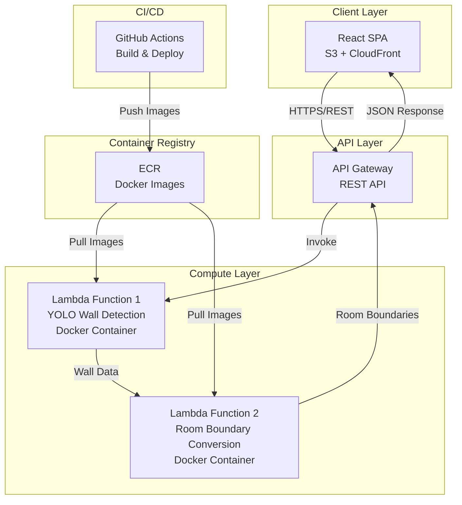

### Request Flow

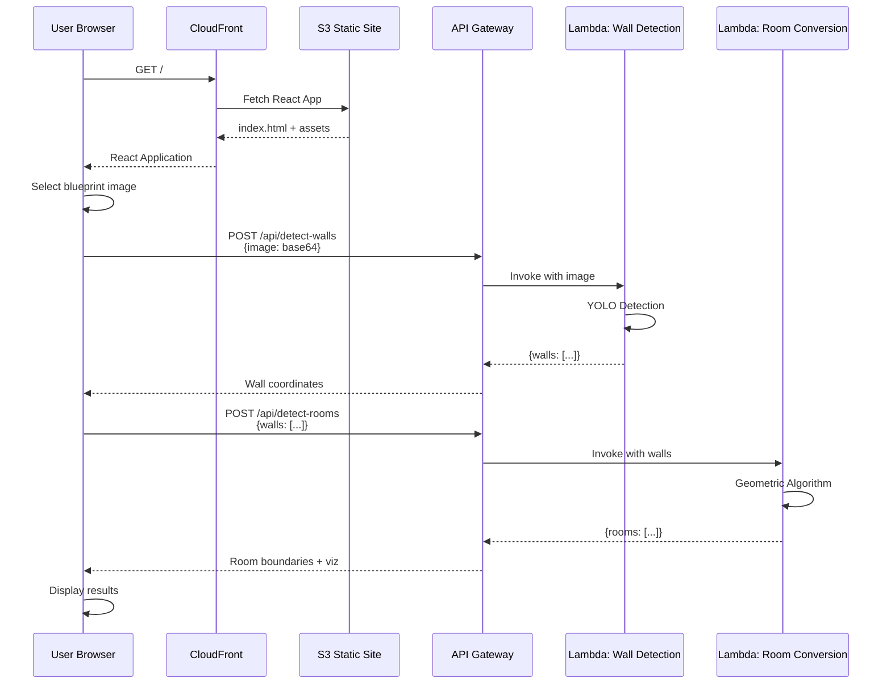

### Data Flow

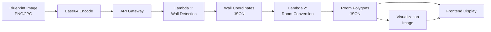

---

## Core Technologies

### Backend Stack

```yaml
Language: Python 3.11
Framework: FastAPI 0.104+
Web Server: Uvicorn
Container: Docker (Alpine-based)
Runtime: AWS Lambda (Container Image)

Key Libraries:
  - fastapi: REST API framework
  - uvicorn: ASGI server
  - pydantic: Data validation
  - opencv-python: Image processing
  - numpy: Numerical operations
  - ultralytics: YOLO model
  - mangum: Lambda adapter for ASGI
  - pillow: Image manipulation
  - boto3: AWS SDK (optional)
```

### Frontend Stack

```yaml
Language: TypeScript 5+
Framework: React 18
Build Tool: Vite
State Management: React Hooks + Context API
Styling: Tailwind CSS
HTTP Client: Axios

Key Libraries:
  - react: UI framework
  - react-router-dom: Routing
  - axios: HTTP requests
  - tailwindcss: Styling
  - react-dropzone: File upload
  - canvas-confetti: Success animations
```

### Infrastructure Stack

```yaml
Compute:
  - AWS Lambda (Container Images, 10GB memory)
  - API Gateway (REST API)

Storage:
  - S3 (Static website hosting)
  - ECR (Docker image registry)

CDN:
  - CloudFront (Global distribution)

CI/CD:
  - GitHub Actions (Build & deploy)
  - Docker Hub (Optional backup registry)

Monitoring:
  - CloudWatch Logs
  - CloudWatch Metrics
  - X-Ray (Optional tracing)
```

---

## Component Architecture

### Lambda Function 1: Wall Detection

```mermaid
graph TB
    subgraph "Wall Detection Lambda"
        A[FastAPI App] --> B[/api/detect-walls]
        B --> C[Request Validation]
        C --> D[Image Decode]
        D --> E[YOLO Model]
        E --> F[Post-Processing]
        F --> G[Response Format]
        
        subgraph "YOLO Pipeline"
            E --> E1[Load Model]
            E1 --> E2[Inference]
            E2 --> E3[NMS]
            E3 --> E4[Filter by Confidence]
        end
    end
```

**Input:**
```json
{
  "image": "base64_encoded_image",
  "confidence_threshold": 0.10,
  "image_format": "png"
}
```

**Output:**
```json
{
  "success": true,
  "walls": [
    {
      "id": "wall_001",
      "bounding_box": [x1, y1, x2, y2],
      "confidence": 0.85
    }
  ],
  "total_walls": 34,
  "processing_time_ms": 35
}
```

### Lambda Function 2: Room Boundary Detection

```mermaid
graph TB
    subgraph "Room Detection Lambda"
        A[FastAPI App] --> B[/api/detect-rooms]
        B --> C[Request Validation]
        C --> D[Grid Creation]
        D --> E[Wall Drawing]
        E --> F[Morphology]
        F --> G[Connected Components]
        G --> H[Polygon Extraction]
        H --> I[Visualization]
        I --> J[Response Format]
        
        subgraph "Geometric Algorithm"
            D --> D1[Create Binary Grid]
            E --> E1[Draw Walls]
            E1 --> E2[Invert Grid]
            F --> F1[Closing]
            F1 --> F2[Opening]
            G --> G1[CCL Algorithm]
            G1 --> G2[Filter by Area]
            H --> H1[Find Contours]
            H1 --> H2[Simplify Polygons]
        end
    end
```

**Input:**
```json
{
  "walls": [...],
  "image_dimensions": [width, height],
  "min_room_area": 2000,
  "return_visualization": true
}
```

**Output:**
```json
{
  "success": true,
  "rooms": [
    {
      "id": "room_001",
      "polygon_vertices": [[x1,y1], [x2,y2], ...],
      "bounding_box": {...},
      "area_pixels": 40000,
      "confidence": 0.92
    }
  ],
  "visualization": "base64_encoded_image",
  "total_rooms": 7
}
```

### Frontend Application

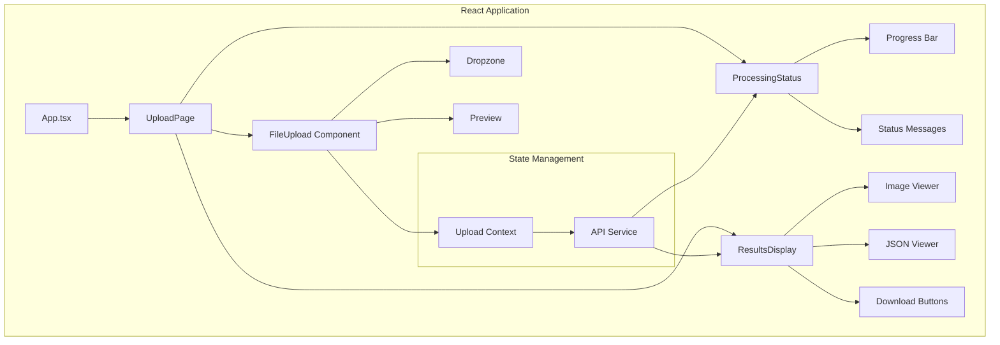

---

## API Specification

### Endpoint 1: Wall Detection

```
POST /api/detect-walls
Content-Type: application/json
```

**Request:**
```typescript
interface WallDetectionRequest {
  image: string;              // Base64 encoded
  confidence_threshold?: number; // Default: 0.10
  image_format?: string;      // Default: "png"
}
```

**Response:**
```typescript
interface WallDetectionResponse {
  success: boolean;
  walls: Array<{
    id: string;
    bounding_box: [number, number, number, number];
    confidence: number;
  }>;
  total_walls: number;
  image_dimensions: [number, number];
  processing_time_ms: number;
}
```

**Error Response:**
```typescript
interface ErrorResponse {
  success: false;
  error: {
    code: string;
    message: string;
    details?: any;
  };
}
```

### Endpoint 2: Room Boundary Detection

```
POST /api/detect-rooms
Content-Type: application/json
```

**Request:**
```typescript
interface RoomDetectionRequest {
  walls: Array<{
    id: string;
    bounding_box: [number, number, number, number];
    confidence: number;
  }>;
  image_dimensions: [number, number];
  min_room_area?: number;        // Default: 2000
  return_visualization?: boolean; // Default: true
}
```

**Response:**
```typescript
interface RoomDetectionResponse {
  success: boolean;
  rooms: Array<{
    id: string;
    polygon_vertices: Array<[number, number]>;
    bounding_box: {
      x_min: number;
      y_min: number;
      x_max: number;
      y_max: number;
    };
    area_pixels: number;
    centroid: [number, number];
    confidence: number;
    shape_type: "rectangle" | "l_shape" | "complex";
  }>;
  visualization?: string; // Base64 encoded image
  total_rooms: number;
  processing_time_ms: number;
}
```

### Endpoint 3: Combined Detection (Future)

```
POST /api/detect-all
Content-Type: application/json
```

Combines both endpoints for single-request processing.

---

## Directory Structure

```
room-boundary-detection/
├── backend/
│   ├── lambda-wall-detection/
│   │   ├── Dockerfile
│   │   ├── requirements.txt
│   │   ├── app/
│   │   │   ├── __init__.py
│   │   │   ├── main.py              # FastAPI app
│   │   │   ├── models.py            # Pydantic models
│   │   │   ├── detection.py         # YOLO logic
│   │   │   └── utils.py             # Helpers
│   │   └── models/
│   │       └── yolov8l.pt
│   │
│   └── lambda-room-detection/
│       ├── Dockerfile
│       ├── requirements.txt
│       ├── app/
│       │   ├── __init__.py
│       │   ├── main.py              # FastAPI app
│       │   ├── models.py            # Pydantic models
│       │   ├── geometric.py         # Room detection logic
│       │   ├── visualization.py     # Image generation
│       │   └── utils.py             # Helpers
│       └── tests/
│
├── frontend/
│   ├── public/
│   │   └── index.html
│   ├── src/
│   │   ├── components/
│   │   │   ├── FileUpload.tsx
│   │   │   ├── ProcessingStatus.tsx
│   │   │   ├── ResultsDisplay.tsx
│   │   │   ├── ImageViewer.tsx
│   │   │   └── JSONViewer.tsx
│   │   ├── services/
│   │   │   └── api.ts               # API client
│   │   ├── types/
│   │   │   └── index.ts             # TypeScript types
│   │   ├── contexts/
│   │   │   └── UploadContext.tsx
│   │   ├── App.tsx
│   │   └── main.tsx
│   ├── package.json
│   ├── tsconfig.json
│   ├── vite.config.ts
│   └── tailwind.config.js
│
├── infrastructure/
│   ├── terraform/                   # Or CloudFormation
│   │   ├── main.tf
│   │   ├── api-gateway.tf
│   │   ├── lambda.tf
│   │   ├── s3.tf
│   │   └── cloudfront.tf
│   └── scripts/
│       ├── deploy-backend.sh
│       └── deploy-frontend.sh
│
├── .github/
│   └── workflows/
│       ├── backend-ci.yml
│       ├── frontend-ci.yml
│       └── deploy-production.yml
│
├── _docs/
│   ├── architecture.md              # This file
│   ├── task-list.md
│   ├── api-reference.md
│   └── deployment-guide.md
│
└── README.md
```

---

## Deployment Architecture

### Development Environment

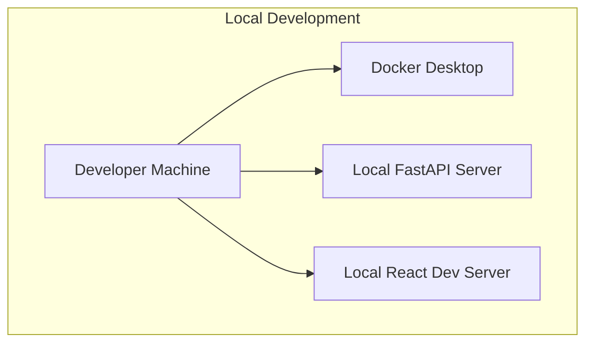

### Production Environment

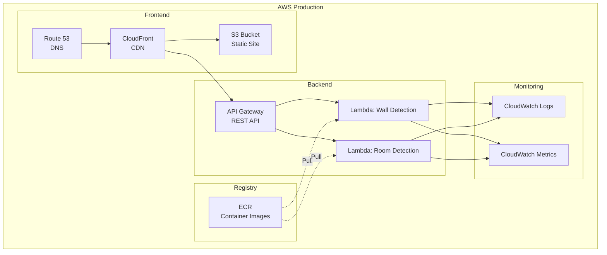

---

## CI/CD Pipeline

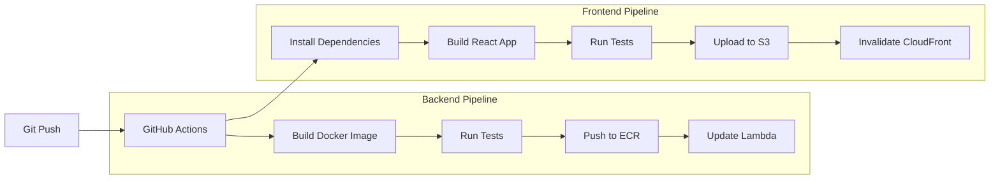

### GitHub Actions Workflow

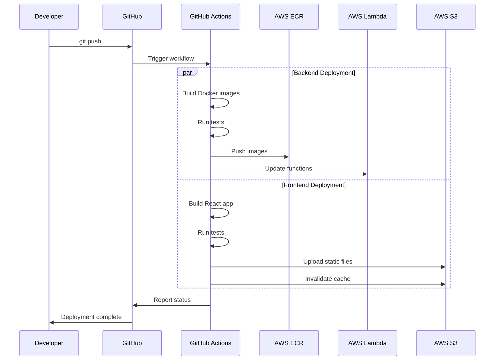

---

## Scalability & Performance

### Lambda Configuration

```yaml
Wall Detection Lambda:
  Memory: 10240 MB (10 GB for YOLO model)
  Timeout: 30 seconds
  Concurrency: 10 (MVP) → 100 (Production)
  Cold Start: ~5 seconds (container image)
  Warm Execution: ~100ms
  
Room Detection Lambda:
  Memory: 3008 MB (3 GB for OpenCV)
  Timeout: 30 seconds
  Concurrency: 10 (MVP) → 100 (Production)
  Cold Start: ~2 seconds
  Warm Execution: ~50ms
```

### Performance Targets

```yaml
MVP (Synchronous):
  Total Response Time: <5 seconds
  Wall Detection: <2 seconds
  Room Detection: <1 second
  Network Overhead: <2 seconds
  
Production (Async - Future):
  Upload Time: <1 second
  Processing: Background job
  Notification: WebSocket/Polling
  Total User Wait: <10 seconds
```

### Scaling Strategy

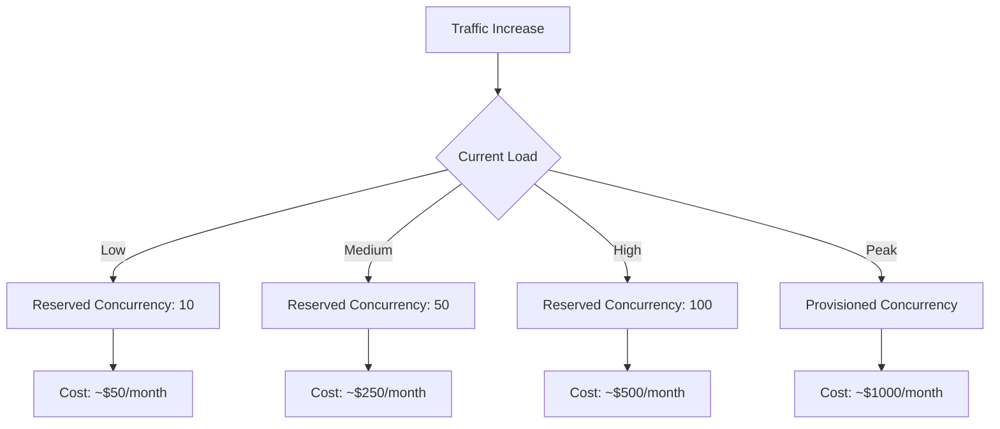

---

## Security Architecture

### Authentication & Authorization (Future)

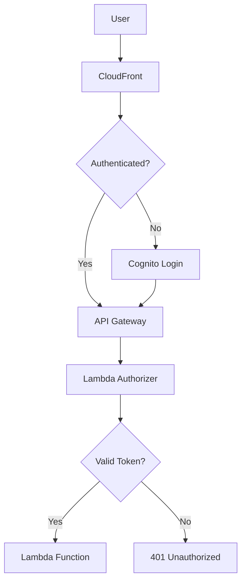

### Data Security

```yaml
In Transit:
  - HTTPS/TLS 1.3 (CloudFront + API Gateway)
  - Certificate: AWS Certificate Manager

At Rest:
  - Not applicable (no persistent storage)

Runtime:
  - Lambda execution role (least privilege)
  - VPC: Not required (no private resources)
  - Secrets: None (stateless)

CORS:
  - Allowed Origins: CloudFront domain
  - Allowed Methods: POST, OPTIONS
  - Allowed Headers: Content-Type, Authorization
```

---

## Monitoring & Observability

### CloudWatch Dashboard

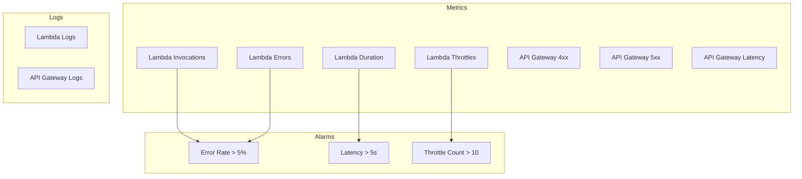

### Logging Strategy

```yaml
Application Logs:
  Level: INFO (Production), DEBUG (Development)
  Format: JSON structured logging
  Fields:
    - timestamp
    - request_id
    - user_id (future)
    - endpoint
    - processing_time
    - error_details
    
CloudWatch Log Groups:
  - /aws/lambda/wall-detection
  - /aws/lambda/room-detection
  - /aws/apigateway/rest-api
  
Retention: 7 days (MVP) → 30 days (Production)
```

---

## Cost Estimation

### Monthly Cost Breakdown (MVP - 1000 requests)

```yaml
Lambda Execution:
  Wall Detection: 1000 × 2s × $0.0000166667 = $0.033
  Room Detection: 1000 × 0.5s × $0.0000133333 = $0.007
  Total Lambda: $0.04
  
API Gateway:
  Requests: 2000 × $0.0000035 = $0.007
  
CloudFront:
  Requests: 1000 × $0.0000010 = $0.001
  Data Transfer: 1 GB × $0.085 = $0.085
  
S3:
  Storage: 0.1 GB × $0.023 = $0.002
  Requests: 1000 × $0.0000004 = $0.0004
  
ECR:
  Storage: 2 GB × $0.10 = $0.20
  
Total Monthly Cost: ~$0.34
```

### Cost at Scale (10,000 requests/month)

```yaml
Lambda: $0.40
API Gateway: $0.07
CloudFront: $0.95
S3: $0.02
ECR: $0.20

Total: ~$1.64/month
```

---

## Disaster Recovery & Backup

### Strategy

```yaml
Lambda Functions:
  - Multi-region: Not required (MVP)
  - Versioning: Enabled (latest, previous, stable)
  - Aliases: production, staging, development
  
ECR Images:
  - Retention: Keep last 10 images
  - Backup: GitHub Actions artifacts
  
Frontend Assets:
  - S3 Versioning: Enabled
  - Backup: Git repository
  
Configuration:
  - Infrastructure as Code: Terraform/CloudFormation
  - Stored in: Git repository
  
RTO (Recovery Time Objective): 1 hour
RPO (Recovery Point Objective): Last commit
```

---

## Future Enhancements

### Phase 2: Asynchronous Processing

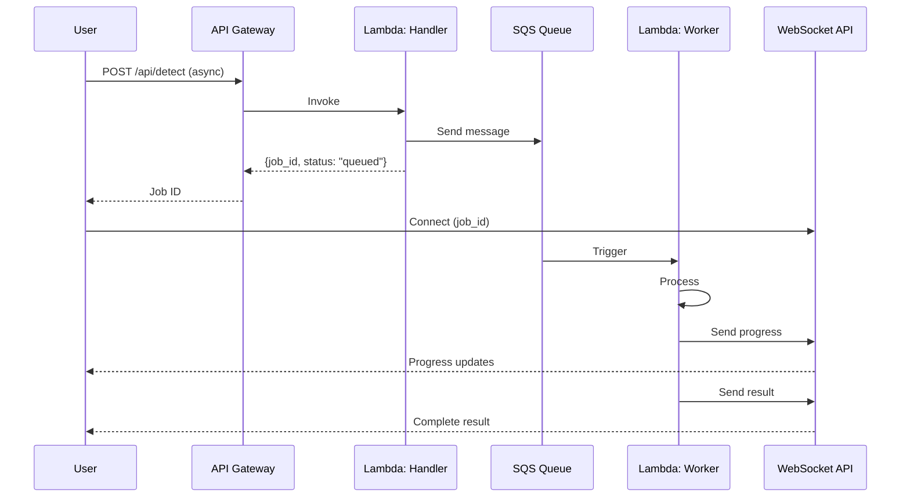

### Phase 3: Batch Processing

```yaml
Feature: Process multiple blueprints
Technology: Step Functions
Flow:
  1. Upload multiple files → S3
  2. Step Function orchestrates
  3. Parallel Lambda invocations
  4. Aggregate results
  5. Download ZIP
```

### Phase 4: User Accounts & History

```yaml
Features:
  - User authentication (Cognito)
  - Processing history (DynamoDB)
  - Saved results (S3)
  - Usage analytics
```

---

## Technology Decisions & Rationale

### Why FastAPI?

```yaml
Pros:
  - Fast (async support)
  - Type hints (Pydantic)
  - Auto-generated docs
  - Easy testing
  - Lambda compatible (Mangum)

Alternatives Considered:
  - Flask: Less performant
  - Django: Too heavyweight
  - Plain Lambda: Less structure
```

### Why React?

```yaml
Pros:
  - Industry standard
  - Large ecosystem
  - TypeScript support
  - Easy deployment

Alternatives Considered:
  - Vue: Smaller ecosystem
  - Svelte: Less mature
  - Vanilla JS: More code
```

### Why Lambda?

```yaml
Pros:
  - No server management
  - Pay per use
  - Auto-scaling
  - Fast deployments

Alternatives Considered:
  - ECS/Fargate: More overhead
  - EC2: Manual scaling
  - App Runner: Less control
```

### Why Docker Containers for Lambda?

```yaml
Pros:
  - 10GB image size (YOLO model ~200MB)
  - Consistent environments
  - Local testing
  - Easy CI/CD

Alternatives Considered:
  - ZIP deployment: 250MB limit
  - Lambda Layers: Size restrictions
```

---

## Development Principles

### Modularity

```yaml
Separation of Concerns:
  - Wall detection: Independent Lambda
  - Room detection: Independent Lambda
  - Frontend: Decoupled from backend
  
Benefits:
  - Independent scaling
  - Easier testing
  - Simpler deployments
  - Team parallelization
```

### Scalability

```yaml
Horizontal Scaling:
  - Lambda auto-scales
  - API Gateway auto-scales
  - CloudFront global
  
Vertical Scaling:
  - Lambda memory: 128MB → 10GB
  - Timeout: 3s → 15min
```

### Maintainability

```yaml
Code Organization:
  - Clear directory structure
  - Type hints (Python + TypeScript)
  - Comprehensive tests
  - Documentation as code
  
Infrastructure as Code:
  - Terraform/CloudFormation
  - Version controlled
  - Reproducible deployments
```

---

## Testing Strategy

### Backend Testing

```yaml
Unit Tests:
  - Detection logic
  - Geometric algorithm
  - Utilities
  - Coverage: >80%
  
Integration Tests:
  - API endpoints
  - Lambda handlers
  - Error scenarios
  
Performance Tests:
  - Cold start times
  - Warm execution times
  - Memory usage
```

### Frontend Testing

```yaml
Unit Tests:
  - Components
  - Utilities
  - API client
  
Integration Tests:
  - User flows
  - API mocking
  
E2E Tests:
  - Full upload flow
  - Error handling
```

---

## Summary

This architecture provides:

✅ **Scalable:** Lambda auto-scales to demand  
✅ **Cost-Effective:** Pay-per-use, ~$0.34/month for MVP  
✅ **Fast:** <5s total processing time  
✅ **Maintainable:** Modular, type-safe, well-documented  
✅ **Deployable:** Automated CI/CD via GitHub Actions  
✅ **Reliable:** AWS managed services, 99.9% uptime  

**Ready for MVP deployment and future production scale.**
